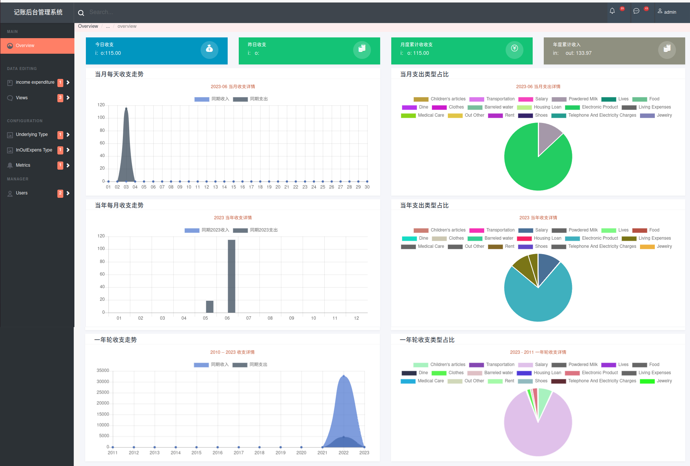

# ConsumptionAccounting
## 简介：
  匆匆忙忙一年又一年，碎银几两，往往过年口袋不剩下几块钱，一年中又无干啥大消费，但是囊中羞涩，又记不起花了哪些钱。
  ### 系统主要功能：
    1.  用来记录日常个人消费明细，国内消费习惯使用线上支付方式:webchat，alipaly主要的两种方式，支持微信支付宝个人账单导入；
    2.  前端-日月年消费明细，统计等可视化展示；
    3.  可视化中一些超标费用进行颜色标注。
  ### 技术栈：
    前端：原生js+jquery+jschart
    后端服务：django
    
 ## 系统展示：
     *. home
           
     *. Daily Inout(明细输入)
          
     *. Views
          *. Day View
              
          *. Month View
              
          *. A round of years View 
              
  ## 环境搭建
     ### 后端服务
         1、创建虚拟环境vitrualenv Env
         2、将finance复制到虚拟环境中
         3、安装依赖
              pip install -r requirements.txt
         5、配置数据库
         6、启动django
    ### 前端
         将前端源码（financeUI）部署到apache-tomcat/webapps/目录下，启动apache-tomcat/bin/startup.sh即可
         登陆：[http:/](http://localhost:8080/finance/)
